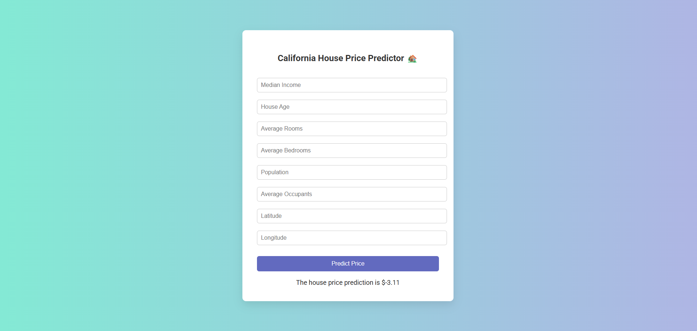
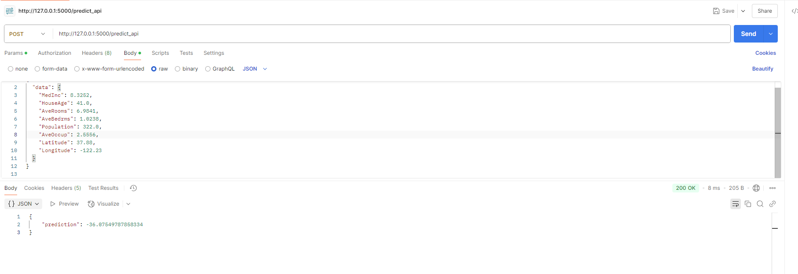

# 🏡 California Housing Price Predictor

This is a web-based machine learning project that predicts **housing prices in California** using a trained regression model. It includes a Flask backend (`app.py`) and a simple HTML frontend (`index.html`).


## RUN THIS CODE ON docker run -p 5000:5000 housing-predictor


---

## 📁 Project Structure

- ├── app.py # Flask backend to serve the model
- ├── index.html # Frontend UI for input and prediction
- ├── regressionModel.pkl # Pre-trained ML model
- ├── scaling.pkl # Scaler used for input transformation
- ├── requirements.txt # Python dependencies
- ├── Dockerfile # For containerization
- ├── .github/workflows/
- │ └── main.yaml # (Optional) GitHub Actions CI/CD pipeline
- └── README.md # You're here!


---

## 🚀 Features

- Predicts **median house value** in California districts.
- Accepts multiple housing attributes:
  - Median Income
  - House Age
  - Total Rooms
  - Bedrooms
  - Population
  - Households
  - Latitude / Longitude
- Lightweight and fast deployment using **Flask**
- Easy-to-use UI built with **HTML**

---

## 🛠️ Setup Instructions

### 1. Clone the Repository

```bash
git clone https://github.com/yourusername/california-housing-predictor.git
cd california-housing-predictor
```

### 2.  Create a Virtual Environment (optional but recommended)
```bash
python -m venv myvenv
source myvenv/bin/activate  # on Windows: myvenv\Scripts\activate
```

### 3. Install Dependencies
```bash
pip install -r requirements.txt
```

### 4. Run the app
```bash
python app.py
```

##### Visit http://localhost:5000


# 🐳 Docker Instructions (Optional)
### Build and Run with Docker
```bash
docker build -t housing-predictor .
docker run -p 5000:5000 housing-predictor
```
#### Visit: http://localhost:5000

## Tech Stack
- Python 3.10
- Flask
- HTML5 / CSS3
- Scikit-learn
- Pandas / Numpy
- Pickle for model serialization
- Docker (optional for containerized deployment)


## Sample Input Format 
- Form fields:
- Median Income: float
- House Age: float
- Total Rooms: int
- Total Bedrooms: int
- Population: int
- Households: int
- Latitude: float
- Longitude: float




🙌 Author
Arun Shukla
Feel free to reach out on [LinkedIn](https://www.linkedin.com/in/arun-shukla-1399a9196/) or open an issue if you encounter problems.

📄 License
This project is licensed under the MIT License.